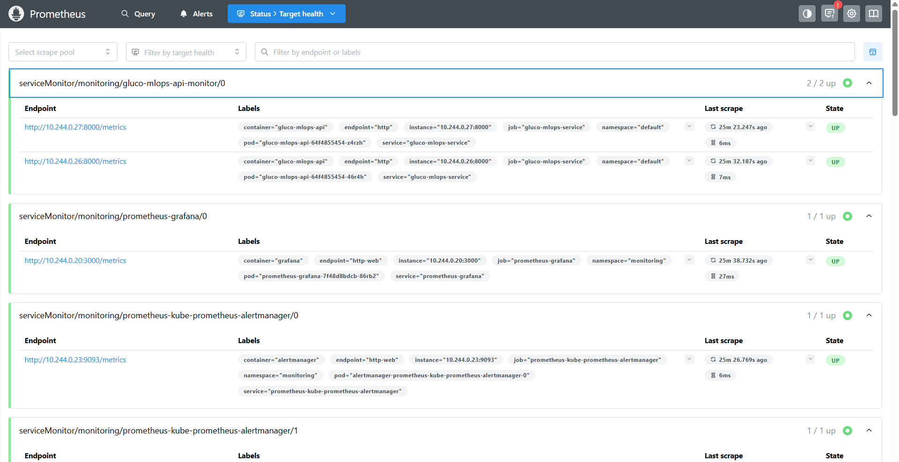
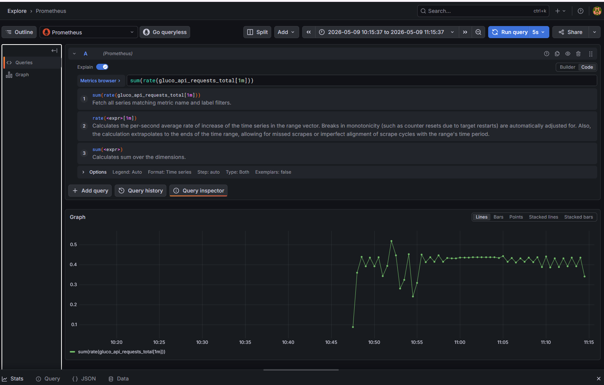
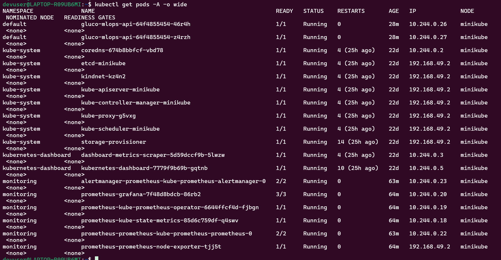
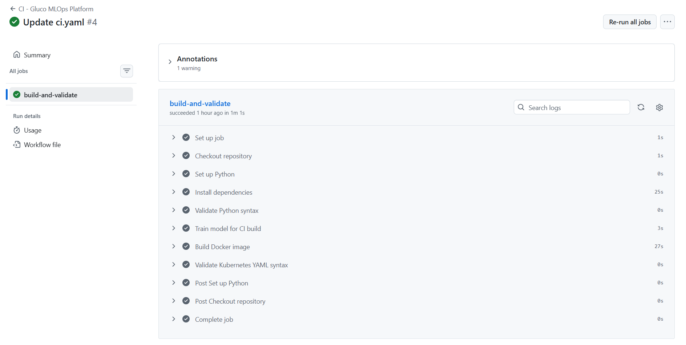

# Gluco MLOps Platform

## Project Overview

Gluco MLOps Platform is an end-to-end cloud-native MLOps project built using FastAPI, Docker, Kubernetes, GitHub Actions, Prometheus, and Grafana.

The platform exposes a machine learning inference API for glucose risk prediction, containerizes the application using Docker, deploys it on Kubernetes, automates CI validation using GitHub Actions, and integrates observability using Prometheus and Grafana.

This project demonstrates production-style DevOps, Platform Engineering, SRE, and MLOps concepts including:

- Kubernetes deployment
- CI automation
- Docker containerization
- Metrics instrumentation
- Prometheus monitoring
- Grafana visualization
- Request throughput analysis
- Latency monitoring

---

# Features

- FastAPI-based ML inference API
- Docker containerization
- Kubernetes deployment using Minikube
- GitHub Actions CI pipeline
- Prometheus metrics integration
- Grafana monitoring dashboards
- Health check endpoint
- Request throughput monitoring
- Request latency monitoring
- ML prediction metrics tracking
- Kubernetes ServiceMonitor integration
- Helm-based monitoring stack deployment

---

# Architecture

```text
                    +----------------------+
                    |      GitHub Repo     |
                    +----------+-----------+
                               |
                               v
                    +----------------------+
                    | GitHub Actions CI/CD |
                    +----------+-----------+
                               |
                               v
                    +----------------------+
                    |   Docker Container   |
                    +----------+-----------+
                               |
                               v
                    +----------------------+
                    | Kubernetes Deployment|
                    +----------+-----------+
                               |
                               v
                    +----------------------+
                    |  FastAPI ML Service  |
                    +----------+-----------+
                               |
             +----------------+----------------+
             |                                 |
             v                                 v
+------------------------+      +---------------------------+
| Prometheus Monitoring  | ---> | Grafana Dashboards        |
+------------------------+      +---------------------------+
```

---

# Tech Stack

| Category | Technologies |
|---|---|
| Programming Language | Python |
| ML Framework | Scikit-learn |
| API Framework | FastAPI |
| Containerization | Docker |
| Container Orchestration | Kubernetes |
| Local Kubernetes | Minikube |
| CI/CD | GitHub Actions |
| Monitoring | Prometheus |
| Visualization | Grafana |
| Package Management | Helm |

---

# Project Structure

```text
gluco-mlops-platform/
│
├── app/
│   ├── main.py
│   ├── predict.py
│   └── requirements.txt
│
├── model/
│   └── glucose_model.pkl
│
├── docker/
│   └── Dockerfile
│
├── kubernetes/
│   ├── deployment.yaml
│   ├── service.yaml
│   └── servicemonitor.yaml
│
├── .github/
│   └── workflows/
│       └── ci.yaml
│
└── README.md
```

---

# API Endpoints

## Health Check

```http
GET /health
```

Response:

```json
{
  "status": "healthy"
}
```

---

## Prediction Endpoint

```http
POST /predict
```

Sample Request:

```json
{
  "glucose": 190,
  "hour": 14,
  "day_of_week": 2,
  "is_overnight": 0
}
```

Sample Response:

```json
{
  "prediction": 1,
  "risk_probability": 0.92
}
```

---

## Metrics Endpoint

```http
GET /metrics
```

Exposes Prometheus metrics for:

- API request count
- Request latency
- Prediction count
- Application metrics

---

# CI/CD Pipeline

GitHub Actions pipeline automatically validates the project whenever code is pushed to GitHub.

## CI Workflow Includes

- Python dependency installation
- Docker image build validation
- Kubernetes manifest validation
- CI pipeline execution

---

# Monitoring & Observability

Prometheus and Grafana are integrated for production-style monitoring and observability.

## Metrics Instrumented

### API Request Count

```promql
gluco_api_requests_total
```

Tracks total API requests.

---

### Prediction Request Count

```promql
gluco_predictions_total
```

Tracks ML prediction requests.

---

### Request Rate

```promql
sum(rate(gluco_api_requests_total[1m]))
```

Measures API throughput in requests per second.

---

### Average API Latency

```promql
sum(rate(gluco_api_request_latency_seconds_sum[1m]))
/
sum(rate(gluco_api_request_latency_seconds_count[1m]))
```

Measures average API response latency.

---

### P95 Latency

```promql
histogram_quantile(
  0.95,
  sum(rate(gluco_api_request_latency_seconds_bucket[1m])) by (le)
)
```

Measures 95th percentile latency.

---

# Deployment Steps

## Clone Repository

```bash
git clone https://github.com/sharanyabhamidipati-cmyk/gluco-mlops-platform.git

cd gluco-mlops-platform
```

---

## Build Docker Image

```bash
docker build -t gluco-mlops-api:latest -f docker/Dockerfile .
```

---

## Load Image into Minikube

```bash
minikube image load gluco-mlops-api:latest
```

---

## Deploy Application

```bash
kubectl apply -f kubernetes/deployment.yaml

kubectl apply -f kubernetes/service.yaml
```

---

## Access Application

```bash
minikube service gluco-mlops-service
```

---

# Prometheus & Grafana Setup

## Install Monitoring Stack

```bash
helm repo add prometheus-community https://prometheus-community.github.io/helm-charts

helm repo update

kubectl create namespace monitoring

helm install prometheus prometheus-community/kube-prometheus-stack -n monitoring
```

---

## Apply ServiceMonitor

```bash
kubectl apply -f kubernetes/servicemonitor.yaml
```

---

## Access Prometheus

```bash
kubectl port-forward -n monitoring svc/prometheus-kube-prometheus-prometheus 9090:9090
```

---

## Access Grafana

```bash
kubectl port-forward -n monitoring svc/prometheus-grafana 3000:80
```

---

# Screenshots

## Prometheus Target Health



---

## Grafana Monitoring Dashboard



---

## Kubernetes Pods




---

## GitHub Actions CI Success



---

# Key Learning Outcomes

This project demonstrates:

- MLOps workflow implementation
- Kubernetes-based application deployment
- Docker containerization
- CI automation with GitHub Actions
- Metrics instrumentation
- Production monitoring and observability
- Prometheus and Grafana integration
- Request throughput analysis
- Latency analysis using PromQL

---

# Remaining Work

The current version demonstrates the core end-to-end MLOps workflow with API serving, Kubernetes deployment, CI validation, Prometheus monitoring, and Grafana visualization.

Planned enhancements:

- MLflow integration for experiment tracking and model registry
- AWS ECR integration for storing Docker images
- AWS EKS deployment for managed Kubernetes
- Helm charts for reusable Kubernetes packaging
- Drift monitoring for tracking data/model behavior changes
- Terraform/CloudFormation infrastructure automation
- Advanced observability and logging using tools like Loki or CloudWatch
- Rollback and blue-green deployment strategy explanation
- Architecture diagram with CI/CD, Kubernetes, and monitoring flow
- Final README polishing and interview-ready documentation

---

# Author

Sharanya B
